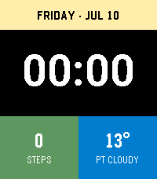

# BigTime CS

A bold, colorful watchface for the **Pebble Time 2** (emery, 200×228 64-color
display), written in C with a PebbleKit JS companion for weather.



## Layout

- **Yellow top band** — weekday and date (`FRIDAY · JUL 10`)
- **Center** — the time in custom Roboto Bold at 56 px on black
- **Green block** — today's step count from the Pebble Health service (`-`
  when health data isn't available)
- **Blue block** — current temperature (°C) and conditions

## Weather

The phone-side JS (`src/pkjs/index.js`) geolocates via the phone and fetches
current conditions from [Open-Meteo](https://open-meteo.com/) — free, no API
key required. The watch requests a refresh every 30 minutes; the last reading
is cached in persistent storage so it survives watchface restarts. Until the
first fetch completes (e.g. before the phone grants location permission), the
block shows `LOADING`.

## Building & running

Requires [pebble-tool](https://developer.repebble.com/sdk/) (Python ≤ 3.13).
Install it in a virtualenv and run `pebble sdk install latest` once.

```sh
source /path/to/venv/bin/activate
pebble build
pebble install --emulator emery       # run in the emulator
pebble screenshot --emulator emery    # grab a screenshot
```

## Installing on a watch

One-time setup: install the Pebble mobile app (<https://repebble.com/app>),
enable **Devices → ⋯ → Dev Connect** (sign in with GitHub), then on your
computer run `pebble login` with the same GitHub account.

```sh
pebble install --cloudpebble          # push to the watch via the cloud relay
pebble logs --cloudpebble             # tail JS/app logs from the phone
```

Alternative: `pebble install --phone <ip>` over local Wi-Fi, or open
`build/BigTime-CS.pbw` with the Pebble app on your phone.

## Project layout

```
src/c/bigtime.c      Watchface: layers, tick/health/AppMessage handlers
src/pkjs/index.js    Weather companion (Open-Meteo, WMO code → label)
resources/fonts/     Roboto Bold TTF (compiled to digits-only 56 px font)
resources/images/    25×25 menu icon
package.json         Project metadata (UUID, platform, resources, message keys)
```

## Customizing

- **Colors**: `GColorYellow`, `GColorIslamicGreen`, `GColorBlueMoon` in
  `src/c/bigtime.c` (`prv_window_load`).
- **Time size**: the number at the end of the font resource name in
  `package.json` (`FONT_ROBOTO_BOLD_56`) sets the pixel size; adjust
  `time_font_h` in the C to match.
- **Units**: Open-Meteo returns °C by default; add
  `&temperature_unit=fahrenheit` to the URL in `src/pkjs/index.js` for °F.

## License

Code is released under the [MIT License](LICENSE). The bundled Roboto Bold font
is © Google, licensed under the Apache License 2.0 — see
[`resources/fonts/LICENSE.txt`](resources/fonts/LICENSE.txt).
